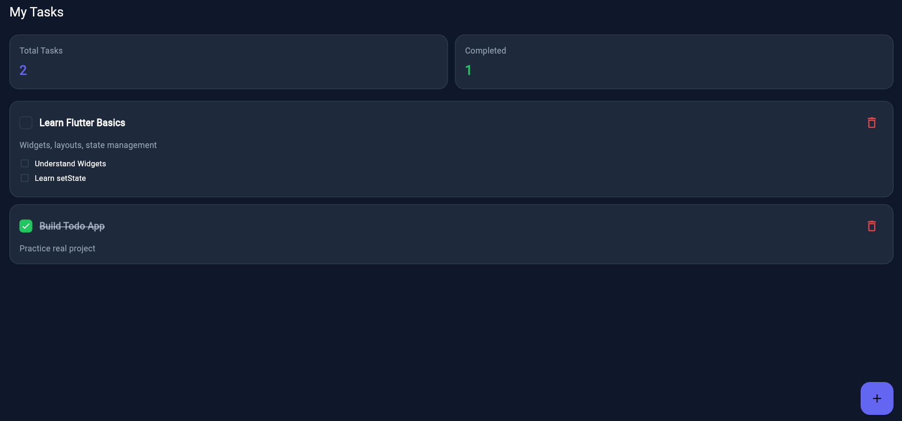
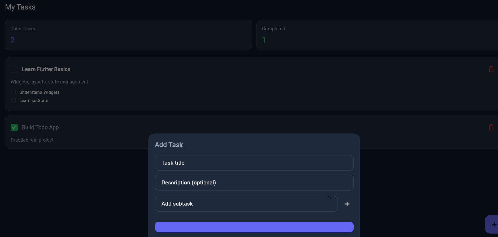

# 📝 Modern Flutter Todo App

A clean and modern Todo app built using Flutter with Provider for state management.
---
## 🌐 Live Demo

👉 [View Website]([sidra-modern-flutter-todo-app.netlify.app](https://sidra-modern-flutter-todo-app.netlify.app/))

## ✨ Features

* Add, edit, and delete tasks
* Mark tasks as complete/incomplete
* Subtasks support
* Task summary (total & completed)
* Clean dark UI

## 📸 Screenshots



---
---



## 🚀 Tech Stack

* Flutter
* Provider

## ▶️ Run Locally

```bash
flutter pub get
flutter run
```

## 🌐 Build for Web

```bash
flutter build web
```

## 📌 Note

This is a frontend-only project (no backend, local state only).
